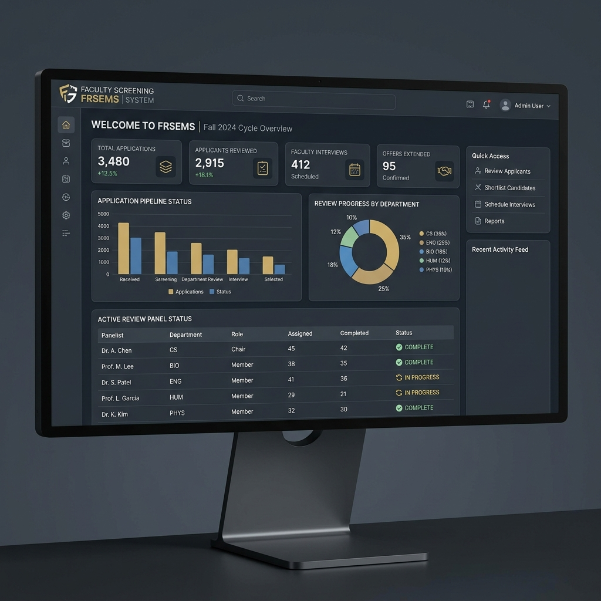
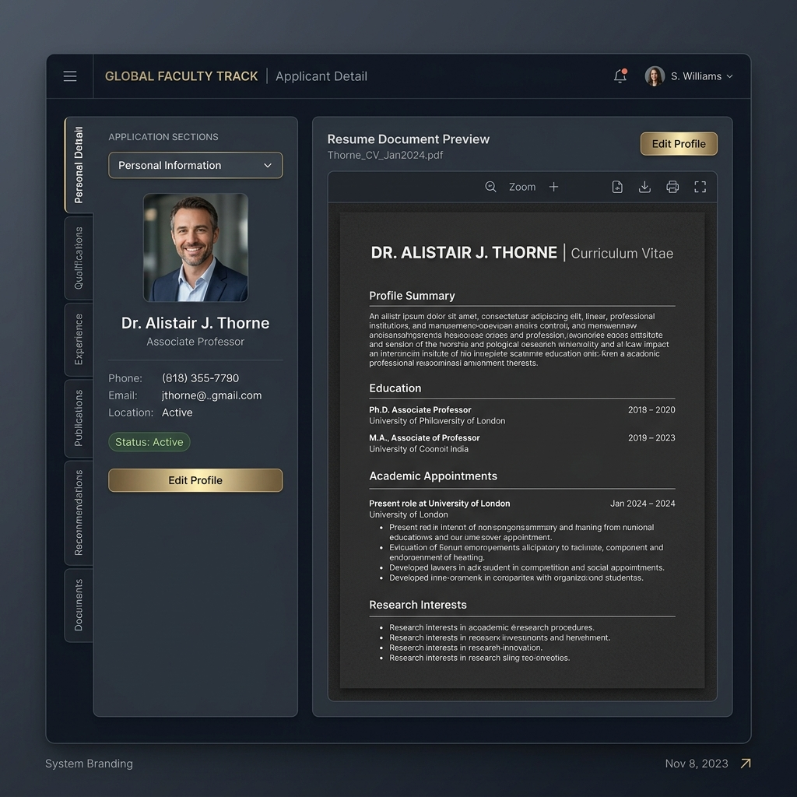
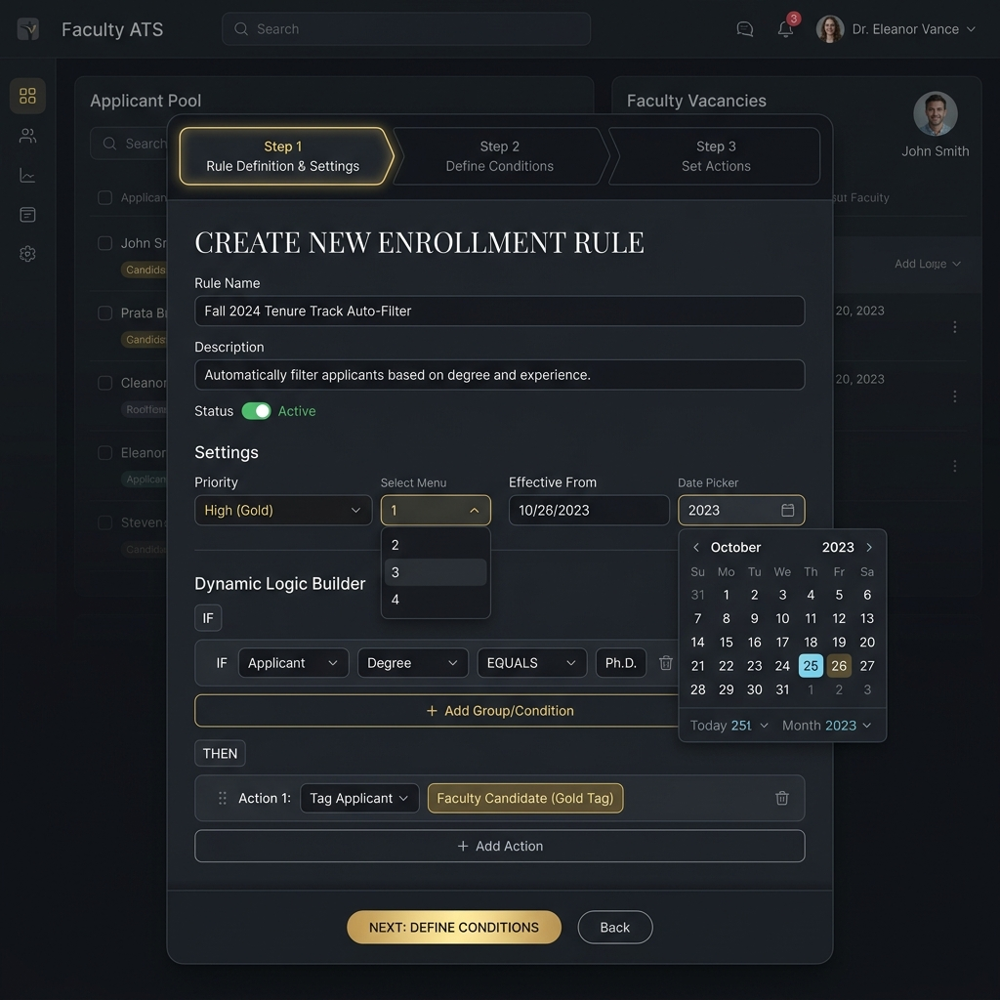

# Faculty Resume Screening & Eligibility Management System (FRSEMS)

A full-stack, production-grade web application custom-built for university faculty hiring, resume screening, and dynamic eligibility rules evaluation. Custom-tailored for institutional environments like **Woxsen University**.

FRSEMS replaces clunky enterprise applicant tracking systems with a high-end, luxury-style institutional portal featuring smooth transitions, clean typography, an explainable rule engine, and system audit logs.

---

## 🏛️ System Architecture

The application is fully decoupled:
```
                                     ┌────────────────────────┐
                                     │   Next.js 15 Client    │
                                     │      (Port 3000)       │
                                     └───────────┬────────────┘
                                                 │ HTTP Requests
                                                 ▼
                                     ┌────────────────────────┐
                                     │  FastAPI Backend API   │
                                     │      (Port 8000)       │
                                     └───────────┬────────────┘
                                                 │ SQLAlchemy Async
                                                 ▼
                                     ┌────────────────────────┐
                                     │  SQLite DB (WAL Mode)  │
                                     │      (frsems.db)       │
                                     └────────────────────────┘
```

---

## 🌟 Key Features & Interface

### 1. Dashboard (`/`)
Displays key metrics cards, recent batch runs, PhD distribution grids, and an interactive criteria-matching chart.



### 2. Candidates & Detail Views (`/candidates` & `/candidates/[id]`)
Searchable candidates table (built with TanStack Table) with manual candidate additions, linked directly to individual detail profiles. Profiles include iframe PDF/raw text previews, qualifications timeline, and status override forms.



### 3. Eligibility Rules Wizard (`/rules/new`)
A 3-step form wizard details, conditions, and logical operator setup (AND/OR) with position selection and date constraints.



---

## 📖 How It Is Used: Step-by-Step Workflow

Follow this guide to screen resumes and configure eligibility conditions:

### Step 1: Manage Specializations & Aliases
Before uploading resumes, navigate to the **Specializations** page:
1. Click **+ Add Specialization**.
2. Register canonical terms (e.g. `Computer Science and Engineering`) for a department.
3. Add text aliases (e.g. `CS`, `CSE`, `Computer Science`) so the parsing normalizer can match variations found on resumes to your core disciplines.

### Step 2: Define Screening Rules
Go to the **Rules** page:
1. Click **+ New Rule**.
2. Enter details: name, description, department (e.g. `CSE`), and job position (e.g. `Assistant Professor`).
3. Set dates for rule activation and a priority rating.
4. Click **Next** to add conditions: select fields (like `ug_degree`, `experience_years`, `phd_status`), select operators (like `equals`, `gte`, `in`), and input matching parameters.
5. Save the rule. It will immediately apply to incoming candidates.

### Step 3: Ingest Resumes
Navigate to **Upload**:
1. Enter a **Batch Name** (e.g., `CSE Recruits - Fall 2026`).
2. Drop or select PDF/DOCX resumes.
3. Click **Start Upload**. The files will automatically go through safety checks (MIME validation, duplication hash checks, and scanned/heuristic checks).
4. *Smart Control*: The system automatically parses qualifications and runs them against active eligibility rules on upload, instantly categorizing candidates.

### Step 4: Audit & Override Candidates
Go to **Candidates**:
1. Check the list of parsed applicants. Candidates are automatically labeled `Eligible` or `Not Eligible`.
2. Click any candidate to open their detail view.
3. View the side-by-side resume preview.
4. If a candidate is marked `Manual Review Required` (due to being flagged as a scanned doc or having unconfirmed text details), select the **Review** tab on the left, change their status, write a mandatory reviewer remark, and save to override.

---

## ⚡ Concurrency & Stress Testing
We configured **WAL (Write-Ahead Logging)** mode on SQLite database connection in `backend/database.py` to allow concurrent async read operations.

We wrote and executed a stress test simulating **500 candidate evaluations** running concurrently across **20 async worker tasks**:
- **Total Evaluations**: 500 candidates
- **Average Latency**: 36.69 ms
- **Throughput**: 27.15 candidates/second
- **Errors/Lockouts**: 0 (WAL connection pool resolved locking)

Run stress tests:
```bash
cd backend
python tests/stress_test.py
```

---

## ☁️ Deploying Frontend to Vercel

To host the Next.js frontend on Vercel:

1. Install the Vercel CLI globally:
```bash
npm install -g vercel
```
2. Navigate to the `frontend` folder:
```bash
cd frontend
```
3. Run the vercel deploy command:
```bash
vercel
```
4. Follow the command prompts to log in, link the project, and set up your deployment.
5. In the Vercel Dashboard, navigate to **Settings > Environment Variables** and define your API URL:
   - Name: `NEXT_PUBLIC_API_URL`
   - Value: `https://YOUR_BACKEND_API_URL/api`

---

## 📤 Push to GitHub

To push updates:
```bash
git add .
git commit -m "docs: Add mockup images, usage guide, and Vercel hosting instructions to README"
git push origin master
```
